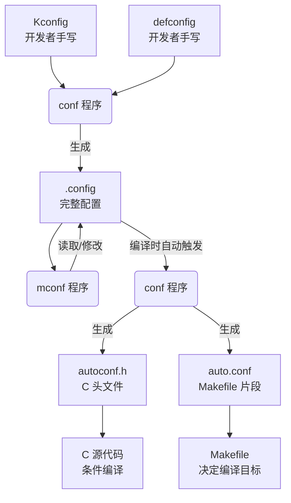

## 前言

每次 `make menuconfig` 弹出那个蓝底菜单界面的时候，我从没认真想过背后到底发生了什么。Kconfig、defconfig、.config、auto.conf……这些文件到底是干嘛的，谁生成的，谁消费的？配置选项是怎么从菜单点击变成 C 代码里的 `#define` 的？

今晚把这条路走了一遍，总算理清了。这篇文章记录 Kbuild 配置系统的核心文件、工具和数据流转关系，不只是 Linux 内核，U-Boot 等同样采用 Kbuild 的项目都适用。

---

## 1. 核心文件与工具定义

| 名称 | 类型 | 角色 | 生成方式 |
|------|------|------|----------|
| **Kconfig** | 文本文件 | **配置项定义**。定义所有可用的 `CONFIG_XXX` 选项、类型、依赖关系及帮助信息。 | 开发者手写 |
| **defconfig** | 文本文件 | **默认配置模板**。仅包含与 Kconfig 默认值不同的配置项（差异集）。 | 开发者手写 / `make savedefconfig` 生成 |
| **.config** | 文本文件 | **最终用户配置**。包含所有配置项的完整状态（`y` / `m` / `n` / `# is not set`）。 | `conf` 程序根据 `defconfig` + `Kconfig` 生成 |
| **autoconf.h** | C 头文件 | **C 语言宏定义**。将 `.config` 转换为 `#define CONFIG_XXX 1`，供源码条件编译使用。 | `conf` 程序根据 `.config` 生成 |
| **auto.conf** | Makefile 片段 | **构建变量赋值**。将 `.config` 转换为 `CONFIG_XXX=y`，供 Makefile 读取以决定编译目标。 | `conf` 程序根据 `.config` 生成 |
| **conf** | C 可执行程序 | **配置解析器**。负责解析 `Kconfig` / `defconfig` / `.config`，并生成上述各种格式的输出。 | 由构建系统编译 `scripts/kconfig/conf.c` |
| **mconf** | C 可执行程序 | **图形化前端**。基于 ncurses 库，提供交互式界面修改 `.config`。 | 由构建系统编译 `scripts/kconfig/mconf.c` |

---

## 2. Makefile 规则与调用逻辑

顶层 `Makefile` 中定义了以下核心规则，用于调度配置过程。

### 2.1 `make xxx_defconfig`

- **依赖**：`scripts/kconfig/conf`（确保解析器已编译）
- **执行命令**：`scripts/kconfig/conf --defconfig=arch/xxx/configs/xxx_defconfig Kconfig`

**处理逻辑**：

1. `conf` 程序读取 `Kconfig` 获取所有选项定义。
2. `conf` 程序读取 `xxx_defconfig` 获取用户预设的差异配置。
3. `conf` 程序合并两者，生成根目录下的 `.config` 文件。

### 2.2 `make menuconfig`

- **依赖**：`scripts/kconfig/mconf`（确保图形前端已编译）
- **执行命令**：`scripts/kconfig/mconf Kconfig`

**处理逻辑**：

1. `mconf` 程序读取 `Kconfig` 渲染菜单结构。
2. 若存在 `.config`，则读取其内容初始化菜单选中状态；若不存在，则使用默认值初始化。
3. 用户在界面修改后，`mconf` 将结果保存回 `.config`。

### 2.3 `make`（编译阶段）

- **依赖**：`.config`
- **自动触发**：在编译任何目标前，Makefile 会检查 `.config` 是否比 `autoconf.h` 新。若是，则自动调用 `conf` 程序进行转换。
- **执行命令**：`scripts/kconfig/conf --silentoldconfig Kconfig`

**处理逻辑**：

1. `conf` 读取 `.config`。
2. 生成 `include/generated/autoconf.h`（供 C 代码 `#include`）。
3. 生成 `include/config/auto.conf`（供 Makefile `include`）。

---

## 3. 数据流转与依赖关系

---

## 4. 关键逻辑总结

1. **Kconfig 是源头**：它定义了"有什么"，是所有配置的基础。
2. **defconfig 是起点**：它定义了"默认选什么"，用于快速初始化 `.config`。
3. **.config 是核心**：它是用户选择的最终记录，也是后续所有转换的唯一输入源。
4. **conf 是转换器**：它在不同阶段扮演不同角色：
   - **初始化阶段**：`Kconfig + defconfig → .config`
   - **构建阶段**：`.config → autoconf.h + auto.conf`
5. **Makefile 是调度器**：它不处理配置逻辑，只负责在正确的时间调用 `conf` 或 `mconf`，并将生成的 `auto.conf` 纳入构建环境。

---

## 5. 实际应用场景

| 场景 | 命令 | 说明 |
|------|------|------|
| 使用已有默认配置 | `make xxx_defconfig` | 从 `arch/xxx/configs/` 下加载预设配置 |
| 保存当前配置为模板 | `make savedefconfig` | 将当前 `.config` 精简为 defconfig 格式 |
| 图形化修改配置 | `make menuconfig` | 基于 ncurses 的交互式配置界面 |
| 仅更新配置（不改动选项） | `make olddefconfig` | 根据 Kconfig 更新 `.config`，新增选项使用默认值 |
| 列出所有可用 defconfig | `make help` | 查看平台默认配置列表 |

---

*理解这套机制后，不管是新增一个配置选项、排查某个功能有没有编译进去，还是给新平台写一个 defconfig，脉络都很清楚。*
